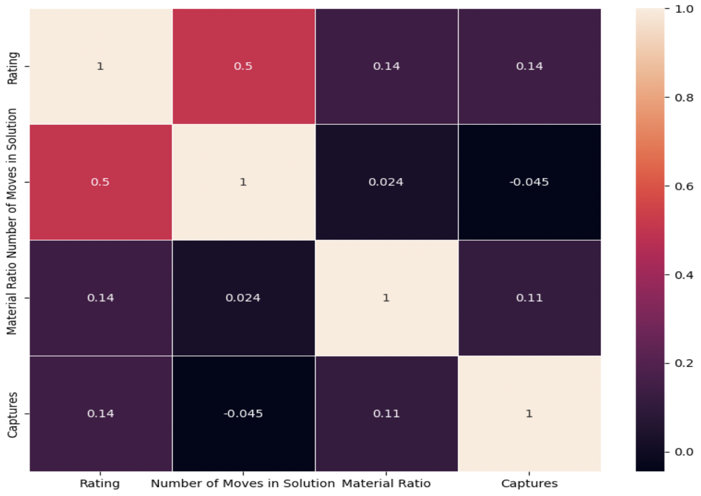
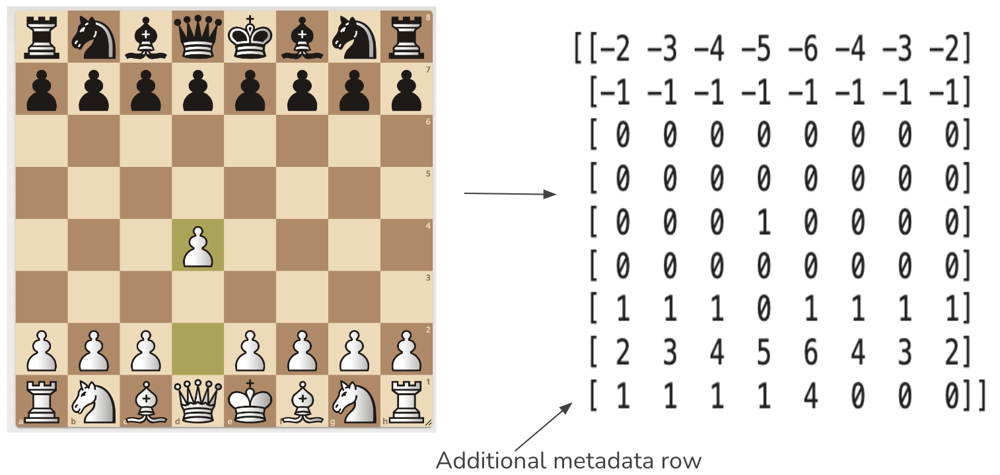
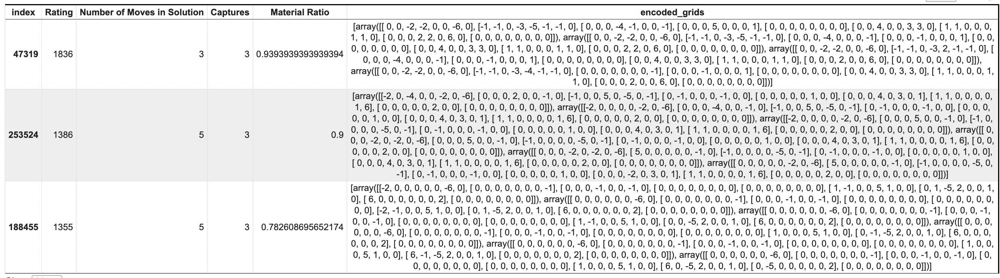

# Decoding Chess Puzzle Difficulty

# Overview

The project aimed to assess engineered features from chess puzzles to predict their difficulty. It evaluates both traditional ML and deep learning models, analyzing the efficacy of numerical features and encoded grids representing board states and move sequences.

# Problem Statetment and Project Significance

**Background:** Currently, the absence of heuristics or models to initialize puzzle difficulty leads to mismatched levels for chess solvers. The elo system rates puzzles from 100 to 3000+, yet new puzzles start uniformly at 1500 before adjusting. Platforms like Lichess.org rate puzzles based on player success rates, but this process is slow and can impact user experience and their ability to learn.

**Importance of Predictive Modeling:** Developing a predictive model for accurately assessing puzzle difficulty can fill exisiting gaps and provide more precise initial ratings, enhancing the overall users and creators of chess puzzles. Improving puzzle rating accuracy will better match solvers with puzzlesin which can lead to better user engagement, tailored skill development and ultimately, elevate the quality of chess puzzle solving for players of all skill levels.

# Research Questions
* Can the elo difficulty of chess puzzles from the Lichess dataset be accurately predicted based on simple features extracted from the board position and the puzzle solution, such as material balance, the number of checks and captures, and the number of moves in the solution?
  
* Do these static quantitative features provide sufficient predictive power when used in deep learning models (i.e., CNN, RNN, attention mechanism architecture)? Do models using RNNs to account for board state and the sequence of required moves in the solution perform better, or do hybrid models combining multiple approaches work best?

# Data Source

 **Note:** Original dataset includes 3.7 million puzzles, however, the project was conducted on varying random samples of the original dataset (Refer to the data folder to retrieve samples)

 ## Feature Selection and Definitions

**Chess Puzzle Rating (Target Variable):**
This is determined empirically by Lichess using the Glicko2 rating system and is currently taken as ground truth for difficulty. 

**Numeric Features under Evaluation**
- **Material Ratio:** This measure is based on the ratio of the weighted sums of pieces for each player’s side. Within the proportion, the numerator represents the puzzle solver’s side, and the denominator represents the opponent’s. It is capped out at 1 as per Lichess puzzle selection criteria.
  
- **Captures:** This feature represents the count of the possible number of opponent’s pieces that can be captured by the solver, based on the starting position.
  
- **Number of Moves in Solution:** This feature counts the moves required to complete the solution sequence (i.e., solution length).

  ## Encoded Grid and Sequential Features
  
  **Note:** The computation for the encoded grid can be retrieved by refering to the python notebook within the data folder

  **Sampled rows that integrated the encdoed grid (sequential)**
  
 
## Predictive Modeling Performances
| Machine Learning Algorithms                             | Training Performance (R-Squared) | Testing Performance (R-Squared) |
|------------------------------------------|-----------------------------------|----------------------------------|
| Linear Regressor                         | 0.29                              | 0.29                             |
| Quadratic Regressor (Degree = 2)         | 0.30                              | 0.30                             |
| K-NN Regressor                           | 0.31                              | 0.29                             |
| Decision Tree Regressor                  | 0.32                              | 0.32                             |
| Random Forest                            | 0.32                              | 0.32                             |
| Stacked Model (Decision Tree and Quadratic) | 0.32                              | 0.32                             |
| DBSCAN Clustering + Decision Tree Regressor | Range from 0.32 to 0.42          | Range from 0.31 to 0.23          |

**All traditional machine learning algorithms presented in the table above used only the numeric features to predict the difficulty of chess puzzles.**

| Deep Learning Algorithm                                         | Training Performance (R-Squared) | Testing Performance (R-Squared) |
|-----------------------------------------------------------------|-----------------------------------|----------------------------------|
| Fully Connected Neural Network                                 | 0.31                              | 0.31                             |
| Fully Connected Neural Network with Initial Chessboard Position | 0.37                              | 0.31                             |
| Fully Connected Neural Network with Initial and Final Chessboard Position | 0.37                              | 0.30                             |
| Convolution Neural Network with Initial Chessboard Position    | 0.37                              | 0.35                             |
| Convolution Neural Network with Initial and Final Chessboard Position | 0.42                              | 0.31                             |
| Architecture with SimpleRNN                                     | 0.47                              | 0.39                             |
| Architecture with LSTM                                          | 0.47                              | 0.42                             |

**All deep learning algorithms listed in the table above utilize both numeric features and some or all aspects of the encoded grid. The exception is the first fully connected neural network, which serves as a reference for comparing the predictive performance of the encoded grid.**

## Model Selection: Architecture with LSTM

 
 

